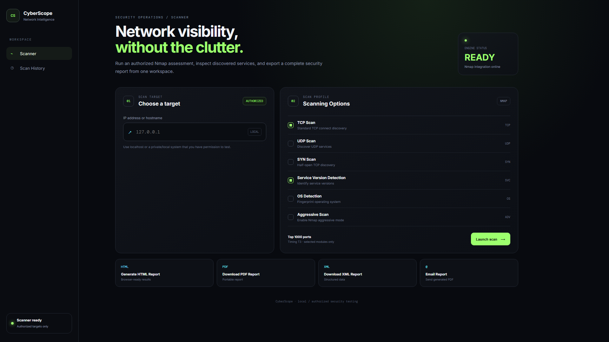
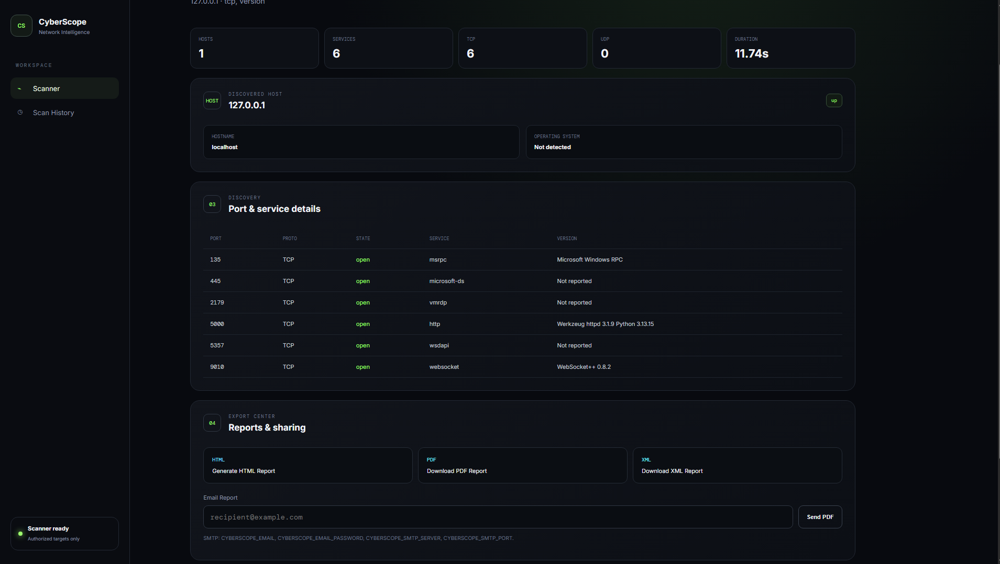

# 🛡️ CyberScope

### Network Security Scanning & Assessment Web Application

CyberScope is a web-based cybersecurity and network scanning application designed to help users perform authorized network security assessments through a simple and responsive dashboard.

The application provides a user-friendly interface for performing different Nmap-based scans, viewing host and service information, generating reports, maintaining scan history, and displaying security recommendations.

> ⚠️ **Legal & Ethical Notice**
>
> CyberScope should only be used against systems, networks, IP addresses, and hosts that you own or have explicit permission to test.
>
> Unauthorized scanning may violate laws, organizational policies, or terms of service.

---

## 📌 Table of Contents

- [About CyberScope](#-about-cyberscope)
- [Project Objectives](#-project-objectives)
- [Key Features](#-key-features)
- [Scan Types](#-scan-types)
- [Report Generation](#-report-generation)
- [Security Recommendations](#-security-recommendations)
- [Scan History](#-scan-history)
- [Technology Stack](#-technology-stack)
- [Project Structure](#-project-structure)
- [Requirements](#-requirements)
- [Installation](#-installation)
- [Running CyberScope](#-running-cyberscope)
- [Using the Application](#-using-the-application)
- [Workflow](#-application-workflow)
- [Screenshots](#-screenshots)
- [Security Considerations](#-security-considerations)
- [Limitations](#-limitations)
- [Future Enhancements](#-future-enhancements)
- [Testing](#-testing)
- [Project Status](#-project-status)
- [Contributing](#-contributing)
- [License](#-license)
- [Author](#-author)

---

# 🔎 About CyberScope

CyberScope is a Python-based network security scanning web application.

The project combines a Flask web interface with Nmap to provide network reconnaissance and security assessment capabilities through a browser-based dashboard.

Instead of requiring users to remember multiple Nmap commands, CyberScope provides a graphical interface where users can enter an authorized target and select the required scanning options.

The application is designed as an independent cybersecurity project with its own:

- Project name
- Branding
- UI
- Dashboard
- Project structure
- Reporting system
- Scan history
- Recommendation system

---

# 🎯 Project Objectives

The main objectives of CyberScope are:

1. Provide a simple web interface for network scanning.
2. Integrate Nmap with a Flask application.
3. Support multiple network scanning techniques.
4. Display discovered hosts, ports, and services clearly.
5. Detect service versions where supported.
6. Provide OS detection capabilities where supported.
7. Generate useful scan reports.
8. Maintain previous scan history.
9. Provide basic security recommendations.
10. Create a responsive and beginner-friendly cybersecurity dashboard.

---

# 🚀 Key Features

CyberScope is designed to provide the following functionality:

### 🔹 Network Scanning

- TCP Scan
- UDP Scan
- SYN Scan
- Service Version Detection
- OS Detection
- Aggressive Scan

### 🔹 Scan Results

The application can display information such as:

- Target host
- IP address
- Host status
- Detected operating system information
- Open ports
- Port protocols
- Running services
- Service versions
- Scan results

### 🔹 Reporting

CyberScope supports report generation in multiple formats:

- HTML Report
- PDF Report
- XML Report

### 🔹 Scan History

Previous scans can be stored and reviewed through the scan history interface.

### 🔹 Security Recommendations

Based on discovered services and ports, CyberScope can provide security-oriented recommendations to help users understand possible areas that require attention.

### 🔹 Email Reports

The application includes functionality for sending generated reports through email when the required email configuration is provided.

### 🔹 Responsive Interface

The dashboard is designed to work across:

- Desktop
- Laptop
- Tablet
- Mobile-sized screens

---

# 🔍 Scan Types

## TCP Scan

TCP scanning can be used to identify TCP ports that are accessible on an authorized target.

It helps users understand which TCP services may be exposed.

---

## UDP Scan

UDP scanning is used to identify accessible UDP services.

UDP scans can take longer than standard TCP scans because UDP communication behaves differently from TCP communication.

---

## SYN Scan

SYN scanning is a commonly used Nmap scanning technique for identifying TCP ports.

The technique sends TCP SYN packets and analyzes the responses to determine port states.

> Administrative privileges may be required depending on the operating system and scan configuration.

---

## Service Version Detection

Service detection attempts to identify:

- Service name
- Service version
- Application information

This can help administrators understand what software is exposed on discovered ports.

---

## OS Detection

OS detection attempts to identify operating-system characteristics of the target.

The accuracy of OS detection depends on:

- Target configuration
- Network conditions
- Firewall behavior
- Available responses
- Nmap detection capabilities

---

## Aggressive Scan

Aggressive scanning combines several Nmap capabilities to collect more detailed information about an authorized target.

This may include:

- OS detection
- Service detection
- Script scanning
- Traceroute-related information

Aggressive scans may generate more network traffic than basic scans.

---

# 📊 Scan Results

CyberScope is designed to organize scan results into useful categories.

### Host Information

Example information includes:

- Target
- Host status
- IP address
- OS information

### Port Information

| Field | Description |
|---|---|
| Port | Network port number |
| Protocol | TCP / UDP |
| State | Open / Closed / Filtered |
| Service | Detected service |
| Version | Detected service version |

---

# 📄 Report Generation

CyberScope provides multiple reporting formats.

## HTML Report

HTML reports provide a browser-friendly representation of scan results.

They can be viewed directly using a web browser.

---

## PDF Report

PDF reports provide a portable version of scan results that can be stored or shared for authorized security assessment purposes.

---

## XML Report

XML reports provide structured scan information that can be useful for:

- Data processing
- Archiving
- Integration
- Further analysis

---

# 📧 Email Reports

CyberScope includes email reporting functionality.

After configuring the required email settings, generated reports can be sent through email.

Email configuration should be stored securely using environment variables rather than directly inside source code.

Example configuration:

```env
SMTP_SERVER=
SMTP_PORT=
SMTP_USERNAME=
SMTP_PASSWORD=
REPORT_EMAIL=
```

Never commit real passwords, API keys, SMTP credentials, or other secrets to GitHub.

---

# 🕒 Scan History

CyberScope maintains information about previous scans through its database functionality.

The history section can be used to review previously performed scans.

Possible historical information includes:

- Target
- Scan type
- Scan date/time
- Result information
- Report information

---

# 🛡️ Security Recommendations

CyberScope can provide security recommendations based on scan observations.

Examples of recommendations may include:

- Review unnecessary open ports.
- Disable services that are not required.
- Keep exposed services updated.
- Restrict administrative services.
- Review firewall rules.
- Avoid exposing sensitive services directly to the Internet.
- Investigate unexpected services.
- Use secure authentication mechanisms.
- Regularly perform authorized security assessments.

Recommendations are intended as general security guidance and should not replace a professional security assessment.

---

# 🧰 Technology Stack

CyberScope uses the following technologies:

### Backend

- Python
- Flask

### Network Scanning

- Nmap
- python-nmap

### Frontend

- HTML5
- CSS3
- JavaScript
- Jinja2 Templates

### Database

- SQLite

### Reporting

- HTML
- PDF
- XML

### Development Environment

- Visual Studio Code
- Git
- GitHub

---

# 📁 Project Structure

```text
CyberScope/
│
├── docs/
│   ├── screenshot/
│   │   ├── history.png
│   │   ├── home.png
│   │   └── result.png
│   │
│   └── PROJECT_STRUCTURE.md
│
├── reports/
│   └── .gitkeep
│
├── scanner/
│   ├── __init__.py
│   ├── nmap_scanner.py
│   └── validator.py
│
├── static/
│   └── style.css
│
├── templates/
│   ├── base.html
│   ├── history.html
│   ├── index.html
│   └── results.html
│
├── .env.example
├── .gitignore
├── README.md
├── app.py
├── database.py
├── email_report.py
├── pdf_report.py
├── recommendations.py
├── requirements.txt
├── scanner_test.py
└── xml_report.py
```

---

# 💻 Requirements

Before running CyberScope, make sure the following are installed:

- Python 3.10+
- Nmap
- Git

Recommended environment:

- Windows
- Visual Studio Code
- PowerShell

CyberScope was developed in a Windows development environment.

---

# 📥 Installation

## 1. Clone the Repository

```bash
git clone https://github.com/NITHSH207/CyberScope.git
```

Move into the project directory:

```bash
cd CyberScope
```

## 2. Verify Python

```bash
python --version
```

## 3. Verify Nmap

```bash
nmap --version
```

If Nmap is not recognized, install Nmap and ensure it is available through the system PATH.

---

# 📦 Install Python Dependencies

```bash
pip install -r requirements.txt
```

---

# ⚙️ Environment Configuration

CyberScope provides:

```text
.env.example
```

Use it as a reference for configuration.

Do not store sensitive credentials directly in source files.

Example:

```env
SMTP_SERVER=your_smtp_server
SMTP_PORT=587
SMTP_USERNAME=your_email
SMTP_PASSWORD=your_password
REPORT_EMAIL=recipient_email
```

> ⚠️ Never upload real passwords or credentials to GitHub.

---

# ▶️ Running CyberScope

From the project directory:

```bash
python app.py
```

If the Flask application starts successfully, the terminal should display a local address similar to:

```text
http://127.0.0.1:5000
```

Open the address in a browser:

```text
http://127.0.0.1:5000
```

---

# 🖥️ Using the Application

A typical CyberScope workflow is:

```text
Open CyberScope
      ↓
Enter authorized target
      ↓
Select scan type
      ↓
Start scan
      ↓
Nmap performs scan
      ↓
CyberScope processes results
      ↓
Display host / port / service information
      ↓
Generate security recommendations
      ↓
Save scan history
      ↓
Generate report
```

---

# 📸 Screenshots

## 🏠 CyberScope Dashboard



## 📊 Scan Results



## 🕒 Scan History


---

# 🔐 Security Considerations

CyberScope is a security testing tool and must be used responsibly.

Only scan:

- Your own systems
- Your own lab environments
- Systems for which you have explicit authorization

Do not use CyberScope to scan third-party systems without permission.

Never commit:

- Passwords
- API keys
- SMTP credentials
- Private tokens
- Secret keys

Use environment variables and `.env` files where appropriate.

---

# ⚠️ Limitations

Network scanning results can be affected by:

- Firewalls
- IDS/IPS systems
- Network latency
- Packet filtering
- Host configuration
- Nmap permissions
- Operating-system restrictions
- Service configuration

OS detection and service detection are not guaranteed to be 100% accurate.

---

# 🔮 Future Enhancements

Possible future improvements include:

- User authentication
- Role-based access control
- Advanced dashboard analytics
- Scan scheduling
- Custom Nmap command profiles
- CVE integration
- Vulnerability database integration
- CVSS-based risk classification
- Interactive charts
- Advanced report templates
- Multi-target scanning
- Background scan jobs
- Real-time scan progress
- Docker deployment
- Cloud deployment
- API endpoints
- Improved mobile interface

---

# 🧪 Testing

CyberScope includes:

```text
scanner_test.py
```

Basic environment verification:

```bash
python --version
nmap --version
pip install -r requirements.txt
python app.py
```

Then open:

```text
http://127.0.0.1:5000
```

---

# 📋 Project Status

| Component | Status |
|---|---|
| Project Structure | ✅ Implemented |
| Git Repository | ✅ Configured |
| GitHub Repository | ✅ Available |
| Python Environment | ✅ Configured |
| Nmap Integration | ✅ Configured |
| Flask Application | 🔄 Testing |
| TCP Scan | 🔄 Testing |
| UDP Scan | 🔄 Testing |
| SYN Scan | 🔄 Testing |
| Service Detection | 🔄 Testing |
| OS Detection | 🔄 Testing |
| Aggressive Scan | 🔄 Testing |
| HTML Reports | 🔄 Testing |
| PDF Reports | 🔄 Testing |
| XML Reports | 🔄 Testing |
| Email Reports | 🔄 Testing |
| Scan History | 🔄 Testing |
| Recommendations | 🔄 Testing |
| Responsive UI | 🔄 Testing |

> Status is updated as individual components are verified in the development environment.

---

# 🤝 Contributing

Contributions and improvements are welcome.

Before making changes:

1. Create a separate branch.
2. Make your changes.
3. Test the application.
4. Commit your changes.
5. Push the branch.
6. Create a pull request.

Example:

```bash
git checkout -b feature/new-feature
git add .
git commit -m "Add new feature"
git push origin feature/new-feature
```

---

# 📜 License

This project is intended for educational, research, and authorized security testing purposes.

Before using CyberScope in a production or organizational environment, review the project's licensing and applicable organizational policies.

---

# 👨‍💻 Author

## NITHSH207

CyberScope is an independent cybersecurity/network security scanning project developed for educational and authorized security assessment purposes.

### GitHub

🔗 https://github.com/NITHSH207/CyberScope

---

# ⭐ Support the Project

If you find CyberScope useful for learning cybersecurity and network security concepts, consider giving the repository a ⭐ on GitHub.

---

## 🛡️ CyberScope

**Scan. Analyze. Understand. Secure.**

> Always scan responsibly. Always test with authorization.
